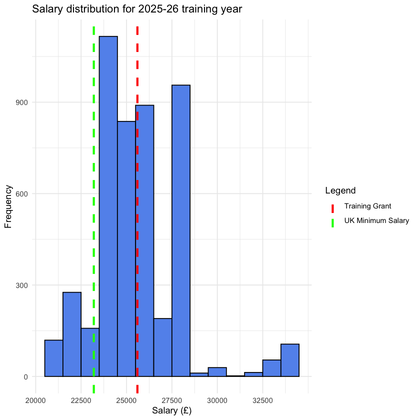
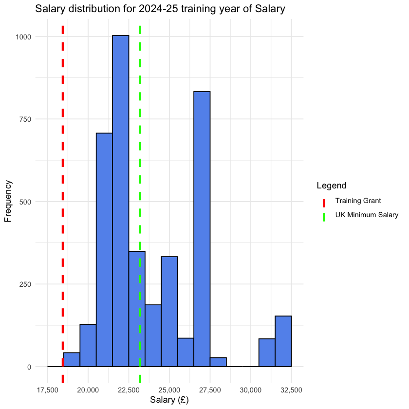

# Trainee Pharmacist (Pre-registration Year) Simple Salary Analysis

## Why?
- **[NHS England must properly value trainee pharmacists](https://www.the-pda.org/nhs-england-must-properly-value-trainee-pharmacists/)**: According to an article by the PDA, there is an urgent need for a pay increase for trainee pharmacists. Pay was a significant factor for me when I went through the Oriel process in 2022. The previous annual grant by NHS England was £18,440, which is set to increase to £26,500 for entrants in 2025/26.
- **Oriel as the Largest Portal for Trainee Pharmacist Programmes**: While I couldn’t determine the total number of trainee pharmacist programmes available (including those not recruited via Oriel), [4000+ programmes](https://www.oriel.nhs.uk/Web/Programme/GetProgramme/UFNockF1WjIvV1ZzdjhtSWpQOEh3ZHV3RHNrUUNOdEROZXlBNDJ3eXhKV2Q1RlloNXB0WFRxWXcwVDRreDIxVw) offered on Oriel make it, without a doubt, the largest portal for trainee pharmacist programmes 
- Applicants using Oriel can download CSV files of all the programmes offered through the platform, which is particularly useful for filtering and ranking preferences during [preferencing](https://www.lasepharmacy.hee.nhs.uk/national-recruitment/preferencing/). These CSV files are also valuable for creating relevant graphs, such as pay distribution charts, which can help raise awareness about salary differences across programmes.

  

## Data Collection

- Datasets from the following years were used for the analysis:
  - 2025-26 training year
  - 2024-25 training year
  - 2023-24 training year
  - 2022-23 training year

## Methodology

## Key Findings

## Insights

## Limitations

## TODO
- Add working hour plot
- Add hourly plot